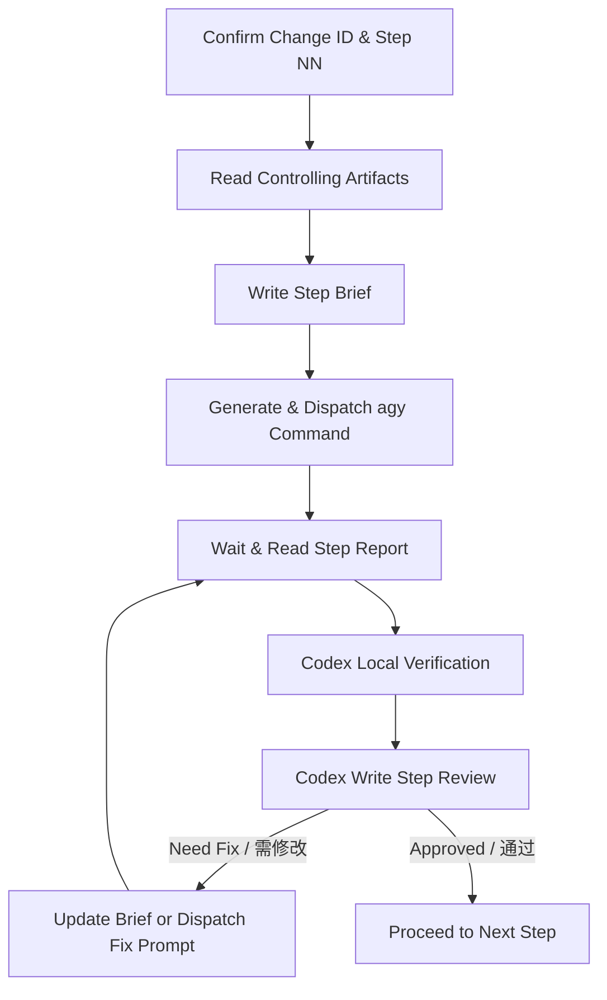

# Codex Brief & Antigravity CLI Review Change Gate

Use this skill to orchestrate and govern development changes when planning/review is decoupled from implementation. Codex acts as the **Orchestrator and Gatekeeper**, while Antigravity CLI (or any external agent) acts as the **Executor**.

Core principle: **Codex designs and reviews; external agents implement; every step leaves a physical audit trail.**

---

## 1. Core Responsibility

- **Decoupled Architecture**: When this skill is active, Codex SHALL NOT edit implementation files. Codex may only edit Brief, Review, planning, or design documentation unless the user explicitly switches back to Codex-implementation mode.
- **Physical Deliverables**: Every step of the collaboration must be documented physically on disk: Brief, Report, and Review.
- **Evidence-Based Gate**: Codex must rerun or independently verify the reported verification commands before granting passage to the next step.
- **External Agent Boundary**: Do not substitute Antigravity CLI with Codex multi-agents when the user explicitly requested external-agent implementation.

---

## 2. Standard Collaboration Flow (标准协作流程)



1. **State Synchronization**: Confirm the current `change-id` and step index `NN` (starting at `01`).
2. **Context Discovery**: Read project instructions, the active plan (`docs/superpowers/plans/YYYY-MM-DD-<change-id>.md`), and specifications (`openspec/changes/<change-id>/*`).
3. **Step Briefing**: Generate the implementation brief at `docs/agent-collab/<change-id>/<NN>-brief.md`.
4. **Task Dispatch**: Create the shell command to execute the brief with Antigravity CLI (`agy`) and present it to the user.
5. **Execution Reporting**: Read the implementation report at `docs/agent-collab/<change-id>/<NN>-report.md` or abort report at `docs/agent-collab/<change-id>/<NN>-report-abort.md`.
6. **Independent Verification**: Codex runs verification commands locally where possible to cross-check the reporter's claim.
7. **Quality Gate Review**: Write the final assessment to `docs/review/YYYY-MM-DD-<change-id>-step-<NN>-review.md`.
8. **Fix Loop**: If the review conclusion is `需修改` (Need Fix), dispatch a correction request and return to step 5.
9. **Promotion**: If the review conclusion is `通过` (Approved), proceed to step `NN + 1`.

---

## 3. Physical Artifact Contract (物理落盘约定)

Use this path contract unless the user or project instructions explicitly override it:

| Artifact | Path |
|---|---|
| Step Brief | `docs/agent-collab/<change-id>/<NN>-brief.md` |
| Step Report | `docs/agent-collab/<change-id>/<NN>-report.md` |
| Abort Report | `docs/agent-collab/<change-id>/<NN>-report-abort.md` |
| Codex Review | `docs/review/YYYY-MM-DD-<change-id>-step-<NN>-review.md` |
| Plan | `docs/superpowers/plans/YYYY-MM-DD-<change-id>.md` |
| OpenSpec change | `openspec/changes/<change-id>/` |

Brief and Report stay together in `docs/agent-collab/<change-id>/`. Codex-owned Review records stay in `docs/review/`.

---

## 4. Step State Machine (步骤推进规则)

- Step `NN` MUST start with `docs/agent-collab/<change-id>/<NN>-brief.md`.
- The external agent MUST produce either `<NN>-report.md` or `<NN>-report-abort.md`.
- Codex MUST write a Review before any next step is created.
- Only a Review conclusion of `通过` permits creating `<NN+1>-brief.md`.
- A Review conclusion of `有风险` may permit limited continuation only when the Review explicitly lists non-blocking risks and next-step constraints.
- A Review conclusion of `需修改` blocks promotion; Codex must dispatch a fix prompt or create a revised Brief.

---

## 5. Non-negotiables (硬约束)

- **No Implementation Code by Codex**: Codex must not edit implementation files while this skill is active unless the user explicitly changes the collaboration mode.
- **No Implicit Substitution**: Do not replace Antigravity CLI or the named external agent with Codex subagents when external-agent implementation was requested.
- **Git Restrictions**: Never run `git add`, `git commit`, `git reset`, or `git clean` unless explicitly commanded by the user.
- **Scope Isolation**: Every Step Brief must explicitly list allowed target files (allow-list) and forbidden areas (block-list).
- **Strict Review Output**: Every review must be persisted inside `docs/review/` and start with one of: `通过`, `有风险`, or `需修改`.
- **Abort Discipline**: If the executor hits a boundary violation, unclear failure, dependency need, architecture/spec change need, permission problem, or unsafe operation, it must stop and write `<NN>-report-abort.md`.
- **Dashboard Integrity**: If a status dashboard exists, only modify `development-log.json`. Do not edit generated markdown or HTML pages directly; compile them via scripts.

---

## 6. Step Brief Requirements

Every Step Brief must include:

- Change ID and step number.
- Executor role.
- Required reading list.
- Allowed files and forbidden files.
- Exact goals for the step only.
- Required commands and expected evidence.
- Abort protocol and abort report path.
- Report path and report format.
- Gate conditions for Codex review.

Briefs should be narrow. If a step needs files outside the allow-list, the executor must abort instead of improvising.

---

## 7. Report and Abort Requirements

A normal Step Report must include:

- Conclusion: `通过` / `有风险` / `需修改`.
- Changed files.
- Implementation summary.
- Verification commands and results.
- RED/GREEN evidence when TDD applies.
- Scope deviation status.
- Remaining risks and questions for Codex.

An Abort Report must include:

- Conclusion beginning with `需修改`.
- Abort reason.
- Already executed operations.
- Error logs or blocked command output.
- Current worktree status.
- Required Codex decision.

Codex must treat an abort report as a blocking gate until reviewed.

---

## 8. Codex Review Requirements

Every Codex Review must include:

- Conclusion: `通过` / `有风险` / `需修改`.
- Review scope with links or paths to Brief, Report, changed files, plan, and specs.
- Code facts with file/line evidence when implementation files changed.
- Positive checks.
- Negative searches / scope drift checks.
- Independent verification records.
- Residual risks.
- Next-step permission: yes/no and constraints.

Codex must not approve a step solely because the external agent claims success. Verification evidence comes before approval.

---

## 9. agy Dispatch Standard (agy 调用与调度规范)

When dispatching execution tasks, Codex must output the following command block:

```bash
agy --print-timeout 30m --print "$(cat <<'EOF'
项目路径：<project-path>

请按以下 Brief 执行 <change-id> Step <NN>：
docs/agent-collab/<change-id>/<NN>-brief.md

执行完成后，请生成报告：
docs/agent-collab/<change-id>/<NN>-report.md

如果遇到越界、阻塞或需要 Codex 判断的问题，请停止并生成：
docs/agent-collab/<change-id>/<NN>-report-abort.md

硬性要求：
- 只允许修改 Brief 指定文件
- 禁止修改 Brief 禁止范围
- 禁止 git add / git commit / git reset / git clean
- 必须运行 Brief 中列出的验证命令
- 报告需包含修改文件、验证命令与结果、是否偏离 Brief、剩余风险
EOF
)"
```

---

## 10. Reference Guide

- **Step Brief Template**: See `references/brief-template.md`
- **Step Report Template**: See `references/report-template.md`
- **Step Review Template**: See `references/review-template.md`
- **Dispatch Template**: See `references/agy-dispatch-template.md`
