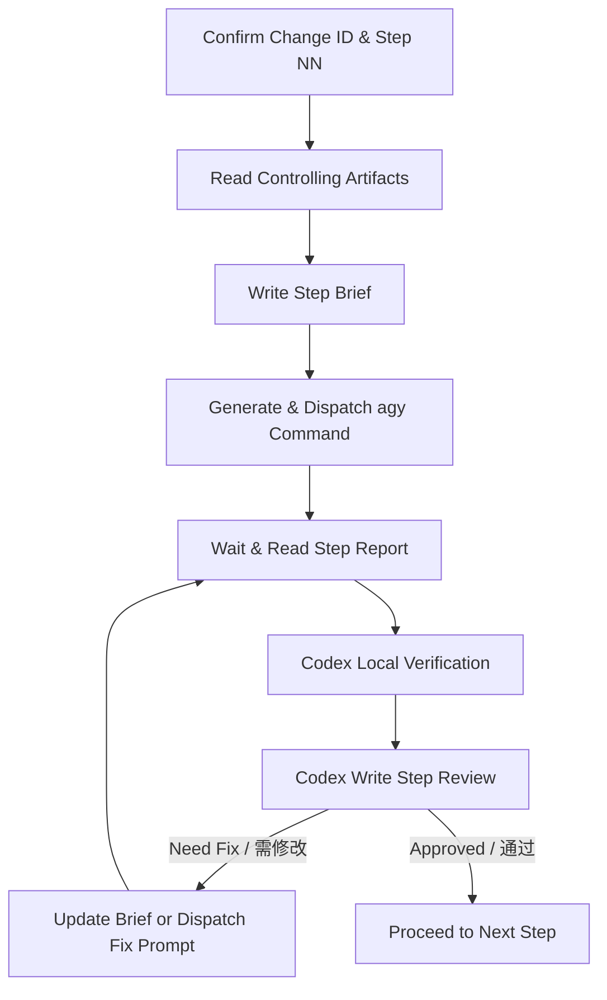

# Codex Brief & Antigravity CLI Review Change Gate

Use this skill to orchestrate and govern development changes when planning/review is decoupled from implementation. Codex acts as the **Orchestrator and Gatekeeper**, while Antigravity CLI (or any external agent) acts as the **Executor**.

Core principle: **Codex designs and reviews; external agents implement; every step leaves a physical audit trail.**

---

## 1. Core Responsibility

- **Decoupled Architecture**: When this skill is active, Codex SHALL NOT edit implementation files. Codex may only edit Brief, Review, planning, or design documentation unless the user explicitly switches back to Codex-implementation mode.
- **Physical Deliverables**: Every step of the collaboration must be documented physically on disk: Brief, Report, and Review.
- **Evidence-Based Gate**: Codex must rerun all verification commands marked `critical` in the Brief, and independently verify at least one non-critical command or changed behavior when possible, before granting passage to the next step.
- **Audit-Grade Review**: Treat external-agent reports as claims to audit, not facts to summarize. No complete Brief evidence means no `PASS`.
- **Business-Chain Integrity**: Unit tests, pipeline tests, and real server/API/business regression are separate evidence layers. Passing `pytest` never implies business-chain success unless the Brief explicitly defines unit tests as the only acceptance layer.
- **External Agent Boundary**: Do not substitute Antigravity CLI with Codex multi-agents when the user explicitly requested external-agent implementation.
- **Executor Ownership Clarity**: Every next-step recommendation MUST explicitly name who executes each part: Codex, external agent (for example Antigravity CLI), or the user. Avoid ambiguous wording such as “we should continue” when responsibility matters.
- **Default External Execution**: Once the user chooses the Codex-design / external-agent-execution collaboration mode, complex implementation, code changes, E2E evidence collection, and heavy local runs default to the external agent. Codex owns Briefs, Reviews, verification spot-checks, gate decisions, and final guidance unless the user explicitly switches modes.

---

## 2. Standard Collaboration Flow (标准协作流程)



1. **State Synchronization**: Confirm the current `change-id` and step index `NN` (starting at `01`).
2. **Context Discovery**: Read project instructions, the active plan (`docs/superpowers/plans/YYYY-MM-DD-<change-id>.md`), and specifications (`openspec/changes/<change-id>/*`).
3. **Step Briefing**: Generate the implementation brief at `docs/agent-collab/<change-id>/<NN>-brief.md`.
4. **Task Dispatch**: Create the shell command to execute the brief with Antigravity CLI (`agy`) and present it to the user.
5. **Execution Reporting**: Read the implementation report at `docs/agent-collab/<change-id>/<NN>-report.md` or abort report at `docs/agent-collab/<change-id>/<NN>-report-abort.md`.
6. **Independent Verification**: Codex runs verification commands locally where possible to cross-check the reporter's claim.
7. **Quality Gate Review**: Write the final assessment to `docs/review/YYYY-MM-DD-<change-id>-step-<NN>-review.md`.
8. **Fix Loop**: If the review conclusion is `需修改` (Need Fix), dispatch a correction request and return to step 5.
9. **Promotion**: If the review conclusion is `通过` (Approved), proceed to step `NN + 1`.

---

## 3. Physical Artifact Contract (物理落盘约定)

Use this path contract unless the user or project instructions explicitly override it:

| Artifact | Path |
|---|---|
| Step Brief | `docs/agent-collab/<change-id>/<NN>-brief.md` |
| Step Report | `docs/agent-collab/<change-id>/<NN>-report.md` |
| Abort Report | `docs/agent-collab/<change-id>/<NN>-report-abort.md` |
| Codex Review | `docs/review/YYYY-MM-DD-<change-id>-step-<NN>-review.md` |
| Plan | `docs/superpowers/plans/YYYY-MM-DD-<change-id>.md` |
| OpenSpec change | `openspec/changes/<change-id>/` |
| Timeout Audit | `docs/review/YYYY-MM-DD-<change-id>-step-<NN>-timeout-audit.md` |
| Status File | `docs/agent-collab/<change-id>/status.md` |

Brief and Report stay together in `docs/agent-collab/<change-id>/`. Codex-owned Review records and Timeout Audits stay in `docs/review/`. The Status File lives alongside Brief/Report to help new windows discover the current step and MUST be updated after each Review (or explaining blocking reasons in the Review).

---

## 4. Step State Machine (步骤推进规则)

- Step `NN` MUST start with `docs/agent-collab/<change-id>/<NN>-brief.md`.
- The external agent MUST produce either `<NN>-report.md` or `<NN>-report-abort.md`.
- If the external agent produces neither report nor abort report after the agreed timeout, Codex MUST stop waiting, inspect the worktree status, and write a timeout audit under `docs/review/` using `references/timeout-audit-template.md` before any next dispatch.
- Codex MUST write a Review before any next step is created.
- Persisted Codex Reviews for external-agent execution MUST use `# Review Result: PASS`, `# Review Result: FAIL`, or `# Review Result: BLOCKED` as the top-level decision.
- Only `PASS` permits creating `<NN+1>-brief.md`.
- `FAIL` blocks promotion when the external agent violated the Brief, changed forbidden scope, failed real regression, or produced evidence contradicting the acceptance criteria.
- `BLOCKED` blocks promotion when required evidence is missing, external dependencies failed, server/API/LLM gateway regression could not complete, or the report lacks enough artifacts to judge business success.
- Do not use ambiguous final decisions such as `基本 OK`, `应该可以`, `看起来通过`, or `有风险` for external-agent Report audit. Put residual non-blocking risks under `Findings`, but the final decision must still be PASS / FAIL / BLOCKED.

---

## 5. Non-negotiables (硬约束)

- **No Implementation Code by Codex**: Codex must not edit implementation files while this skill is active unless the user explicitly changes the collaboration mode.
- **No Implicit Substitution**: Do not replace Antigravity CLI or the named external agent with Codex subagents when external-agent implementation was requested.
- **Git Restrictions**: Never run `git add`, `git commit`, `git reset`, or `git clean` unless explicitly commanded by the user.
- **Scope Isolation**: Every Step Brief must explicitly list allowed target files (allow-list) and forbidden areas (block-list).
- **Structured Backup**: When modifying skill files or project templates, the executor must create a structured backup that preserves relative path directory structures (e.g., `codex-brief-antigravity-review/SKILL.md` instead of a flat list) under the backup directory.
- **Strict Review Output**: Every external-agent audit review must be persisted inside `docs/review/` and start with `# Review Result: PASS`, `# Review Result: FAIL`, or `# Review Result: BLOCKED`.
- **Abort Discipline**: If the executor hits a boundary violation, unclear failure, dependency need, architecture/spec change need, permission problem, unsafe operation, server startup failure, LLM/API gateway error, or required business-chain verification failure, it must stop and write `<NN>-report-abort.md` instead of claiming success.
- **Dashboard Integrity**: If a status dashboard exists, only modify `development-log.json`. Do not edit generated markdown or HTML pages directly; compile them via scripts.

---

## 6. Step Brief Requirements

Every Step Brief must include:

- Change ID and step number.
- Executor role.
- Required reading list.
- Allowed files and forbidden files.
- Exact goals for the step only.
- Required commands and expected evidence, with critical verification commands clearly marked.
- Abort protocol and abort report path.
- Report path and report format.
- Gate conditions for Codex review.
- Business acceptance layers: unit tests, pipeline tests, server/API regression, real business problem acceptance, and which layer is required for `PASS`.
- Subproblem coverage matrix when the user problem contains multiple symptoms or regressions.
- Evidence requirements: command output, raw artifacts, summary artifacts, key assertions, and expected string/count checks.

Briefs should be narrow. If a step needs files outside the allow-list, the executor must abort instead of improvising.

### Anti-False-PASS Rules (通过标准防误报)

- If the Brief requires server/API/business-chain regression, a report that only provides unit tests or `pytest` output is `BLOCKED`, not `PASS`.
- If required `/chat`, server, browser, E2E, LLM, document-tool, or external-service verification fails because of dependency errors such as `502`, timeout, auth failure, missing service, or tool not entered, the correct decision is `BLOCKED`: business repair cannot be judged.
- If real business regression was executed and still reproduces the user-visible failure, the correct decision is `FAIL`.
- If a report says “tests passed” but omits required raw outputs, summary artifacts, key string counts, or acceptance assertions from the Brief, the correct decision is `BLOCKED`.
- Never generalize a narrow subproblem fix to the whole user problem. A review must state exactly which subproblems are covered and which remain unverified.

### Fallback When Skill Is Unavailable (兜底规则)

- If the executing agent (Codex or external) cannot auto-trigger this skill, it SHOULD first attempt to manually read this `SKILL.md` from `~/.codex/skills/codex-brief-antigravity-review/SKILL.md` (or equivalent global installation path) before proceeding.
- If the skill file is still unreachable, the Step Brief MUST be self-contained: it must embed all critical boundary constraints (allow-list, block-list, abort protocol, verification commands) so the agent can execute independently without skill context.
- Codex SHOULD verify skill activation at the start of each new window or session. If activation cannot be confirmed, Codex must include a note in the Brief stating that the executor should treat the Brief as the sole source of truth for execution boundaries.

### Lightweight Status File Convention (状态文件约定)

To help new windows or sessions resume an in-progress collaboration without requiring the user to manually restate the `change-id` and current step:

- After every persisted Codex Review (conclusion `通过`, `有风险`, or `需修改`), Codex MUST update `docs/agent-collab/<change-id>/status.md` with the current step number, conclusion, and next-step owner. If Codex cannot write this file, the Review MUST explain the blocking reasons or risks.
- This file is **mandatory** for state synchronization across windows. If the file cannot be written due to environment or permissions, Codex must explicitly document this block in the Review.
- Format:
  ```
  change-id: <change-id>
  current-step: <NN>
  last-conclusion: 通过 / 有风险 / 需修改
  next-step-owner: Codex / external agent / user
  updated: YYYY-MM-DD HH:MM
  ```
- A new Codex window discovering this file may use it to auto-populate the `change-id` and step index for context discovery (§2 step 1).

---

## 7. Report and Abort Requirements

A normal Step Report must include:

- Conclusion: `PASS` / `FAIL` / `BLOCKED` plus a one-line reason.
- Changed files.
- Implementation summary.
- Verification commands and results, including all critical commands.
- Diff summary with `git diff --stat` and key changed hunks.
- Git/worktree status before and after execution, including staged/unstaged/untracked files.
- Evidence tables: commands, artifacts, key assertions, and business acceptance layers.
- Subproblem coverage matrix when multiple symptoms exist.
- RED/GREEN evidence when TDD applies.
- Scope deviation status.
- Remaining risks and questions for Codex.

No Evidence section means no `PASS`. A report may be concise, but it must be auditable.

An Abort Report must include:

- Conclusion beginning with `BLOCKED`.
- Abort reason.
- Already executed operations.
- Error logs or blocked command output.
- Current worktree status.
- Missing evidence or blocked acceptance layer.
- Required Codex decision.

Codex must treat an abort report as a blocking gate until reviewed.

---

## 8. Codex Review Requirements

Every Codex Review must include:

- Top-level decision: `# Review Result: PASS` / `# Review Result: FAIL` / `# Review Result: BLOCKED`.
- Summary: one sentence explaining the decision.
- Review scope with links or paths to Brief, Report, changed files, plan, specs, raw artifacts, and summary artifacts.
- Brief compliance audit: allowed files, forbidden scope, report/abort presence, worktree preservation.
- Git status audit: `git status --short`, staged changes, unstaged changes, untracked files, and scope drift.
- Verification audit: each required Brief command, whether it ran, output evidence, exit code, and whether server/API/business-chain verification is missing.
- Business acceptance audit: unit tests, pipeline tests, server/API regression, and real user-visible problem acceptance must be judged separately.
- Subproblem coverage matrix: covered / not covered / verification method for each user-visible symptom.
- Code facts with file/line evidence when implementation files changed.
- Positive checks and negative searches / scope drift checks.
- Required fixes for `FAIL` or missing evidence for `BLOCKED`.
- Final Decision: PASS / FAIL / BLOCKED.
- Next-step permission: yes/no and constraints.
- Next-step execution ownership: explicitly state which tasks belong to Codex, the external agent, and the user.

Codex must not approve a step solely because the external agent claims success. Verification evidence comes before approval.

Decision rules:

- Any forbidden-scope edit, destructive git operation, or worktree damage is `FAIL`.
- Any missing critical validation, missing raw/summary artifact, missing required server/API/business-chain regression, or unreachable external dependency is `BLOCKED`.
- Any executed real regression that still shows the user-visible failure is `FAIL`.
- Only when every Brief requirement is satisfied, required evidence exists, and business acceptance passes may Codex write `PASS`.

QAgent-style regression example:

- Brief requires `pytest` plus server `/chat` with specific `app_id` / `version_id` / `doc_id`; Report only says `15 passed` and `58 passed` → `BLOCKED` because `/chat` evidence is missing.
- Report shows `/chat` failed with `Error from llm api: status=502 body=` and did not enter the document tool → `BLOCKED` because business repair cannot be judged.
- Report shows `pytest` passed but development environment output still contains the forbidden string such as `预收账款79898` → `FAIL` because real business regression failed.

---

## 9. agy Dispatch Standard (agy 调用与调度规范)

When dispatching execution tasks, Codex must output the following command block:

```bash
agy --print-timeout 30m --print "$(cat <<'EOF'
项目路径：<project-path>

请按以下 Brief 执行 <change-id> Step <NN>：
docs/agent-collab/<change-id>/<NN>-brief.md

执行完成后，请生成报告：
docs/agent-collab/<change-id>/<NN>-report.md

如果遇到越界、阻塞或需要 Codex 判断的问题，请停止并生成：
docs/agent-collab/<change-id>/<NN>-report-abort.md

硬性要求：
- 只允许修改 Brief 指定文件
- 禁止修改 Brief 禁止范围
- 禁止 git add / git commit / git reset / git clean
- 必须运行 Brief 中列出的验证命令
- 报告需包含修改文件、验证命令与结果、Evidence 表、raw/summary 产物路径、是否偏离 Brief、剩余风险
- 如果 Brief 要求 server/API/business-chain 回归，pytest 通过不能替代真实链路验证
- 缺少关键证据时必须写 BLOCKED，不得写 PASS
EOF
)"
```

---

## 10. Skill Maintenance Notes

When updating this skill itself:

- Read `SKILL.md` before changing the skill package.
- Do not modify `references/` or `agents/` without updating `SKILL.md` or explaining why no navigation change is needed.
- Validate template formatting before completion.
- Never run `git add` or `git commit` unless the user explicitly requests it.
- Do not weaken the Brief → Dispatch → Report → Review quality loop during self-evolution.

---

## 11. Reference Guide

- **Step Brief Template**: See `references/brief-template.md`
- **Step Report Template**: See `references/report-template.md`
- **Step Review Template**: See `references/review-template.md`
- **Dispatch Template**: See `references/agy-dispatch-template.md`
- **Timeout Audit Template**: See `references/timeout-audit-template.md`
